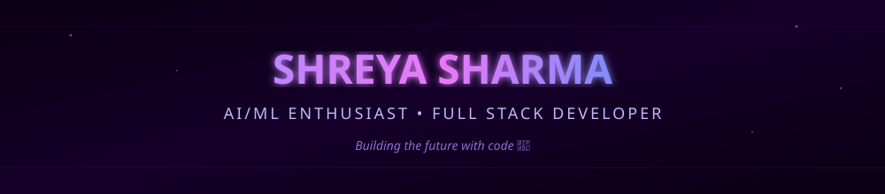
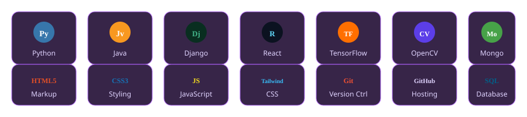
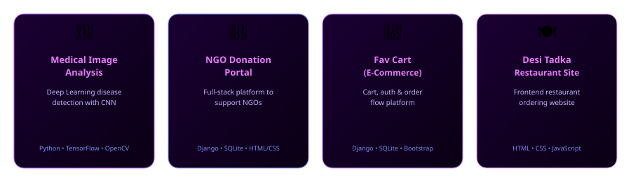
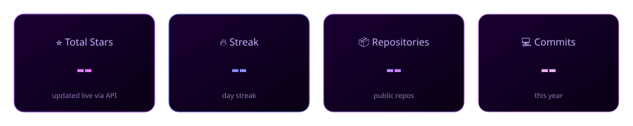

---

## 👋 About Me

- 🎓 B.Tech CSE (AI & ML) Student
- 💜 Passionate about **AI, Machine Learning, Deep Learning** and **Full Stack Development**
- 🚀 Love building real-world projects and learning new technologies
- 🌱 Currently open to **internships** and **software development opportunities**
- ⚡ Fun fact: I can solve problems with code (and coffee) ☕

---

## ⚡ Tech Stack

---

## 🚀 Featured Projects

---

## 📊 GitHub Stats

---

## 🐍 Contribution Snake

---

💜 **Thanks for visiting! Let's connect and build something amazing together.** 💜

🌙 Works in light & dark mode — GitHub auto-inverts badge themes.

